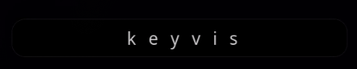

# KeyVis

A lightweight tool for visualizing keystrokes in a clean GTK window. Built using GJS with GObject and Gtk libraries, it provides a simple, responsive way to display keyboard inputs in real-time.



## Features

- Monitors key events and displays them in a window
- Supports visualizing multiple simultaneous key presses
- Automatically hides the window after a configurable timeout

## Installation

### Prerequisites

- [GJS](https://gjs.guide/) (GObject JavaScript) runtime environment
- [GTK 4](https://archlinux.org/packages/extra/x86_64/gtk4/) library
- The [keyd](https://github.com/rvaiya/keyd) utility for capturing keyboard events
- [Bun](https://bun.sh/) for building the application

### Install from AUR 

KeyVis is available in the Arch User Repository (AUR). You can install it using an AUR helper like yay or paru:

```sh
yay -S keyvis
```

### Manual Installation

If you prefer to install KeyVis manually, follow these steps:

Step 1: Clone the Repository

```sh
git clone https://github.com/d7omdev/keyvis
cd keyvis
```

Step 2: Run the Installation script

```sh
./install.sh
```

This script will:

- Create necessary directories.
- Build the application.
- Copy the compiled JavaScript file to the appropriate location.
- Create an executable script for running KeyVis.

## Usage

Running KeyVis

You can run KeyVis using the following command:
```sh
keyvis
```

Killing KeyVis

To kill an existing instance of KeyVis, you can use:

```sh
keyvis --kill # or -k
```

This command will find and terminate any running instance of KeyVis.

Command-Line Options

Use --help to display the available command-line options:

```sh
keyvis --help
```

## Uninstallation

To uninstall KeyVis, run the uninstall script

```sh
./uninstall.sh
```


## Contributions

Contributions and feedback are welcome! If you encounter any issues or have suggestions for improvements, please [submit an issue](https://github.com/d7omdev/keyvis/issues) or create a pull request.

## License

This project is licensed under the [MIT License](LICENSE).

